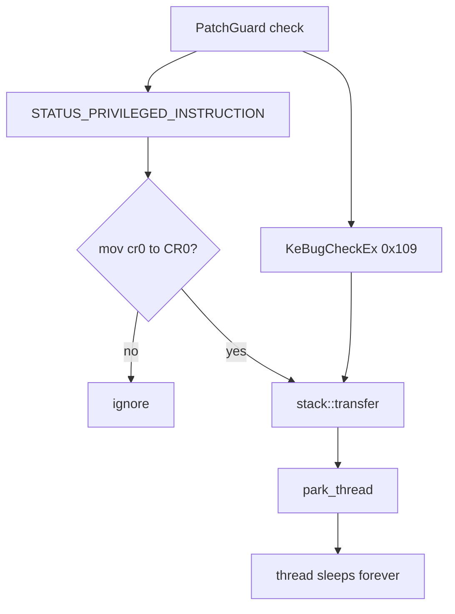

<div align="center">

# PatchGuard-Blocker

**Stop PatchGuard at the exception — not every worker routine.**

C++20 · kernel · paging · shadow hooks

<br/>

```text
                                                        protected page check
                                                                │
                                                                ▼
                                                           mov cr0  (clear WP)
                                                                │
                                                                ▼
                                                          privileged fault ──► KdpReport hook
                                                                │
                                                                ▼
                                                          rewind stack → park thread
```

</div>

## Idea

PatchGuard eventually hits the same pattern: validate a protected region, take a fault, clear `CR0.WP` with `mov cr0`. Instead of enumerating every PG context, this component sits on that exception path.

| Piece | Role |
|-------|------|
| `KdpReport` hook | See kernel first-chance exceptions |
| `mov cr0` filter | Only freeze the WP-clear path |
| Stack transfer | Park the worker with `KeDelayExecutionThread` |
| `KeBugCheckEx` (`0x109`) | Same freeze if it reaches bugcheck |
| Physical page hook | Execute detours from a private page; leave the clean page for readers |

## Flow



## Install

One call after your host paging / physical-memory helpers are up:

```cpp
#include "src/pg.hpp"

if ( !pg::install( ) )
    return STATUS_UNSUCCESSFUL;
```

What `pg::install` does:

1. Physical-hook `KeBugCheckEx`
2. Physical-hook `KdpReport`
3. Set `KdpDebugRoutineSelect = 1`

## Physical page hook

Integrity readers get the **clean** page. Execution uses a **shadow-mapped private copy** with the 14-byte absolute jump + HDE64-aligned NOPs.

```cpp
auto* state = pg::hook::physical::create( target, &original );
if ( !state )
    return false;

pg::hook::physical::enable( state, &detour );
```

Shadow tables live in `pg::hook` (`build_shadow` / `destroy_shadow`). Trampolines go in code caves via `memory::find_cave`.

## Stack park

```cpp
pg::stack::transfer(
    reinterpret_cast< std::uint64_t >( stack_top ) - 8,
    park_thread,
    nullptr );
```

Implemented in C++ for MSVC x64 (bytes in `.text`). No MASM.

## Tree

```text
src/
  pg.hpp                 public entry: pg::install()
  stack/                 RSP switch
  intercept/             KdpReport + KeBugCheckEx logic
  hook/                  physical page hook + shadow maps
```

## Host glue

Not a full WDK project. Drop into a driver that already has:

- `kernel::*` — exports, stacks, CoW, TB flush, debug print  
- `dpm::*` — physical R/W  
- `paging::*` — PTE walk, large-page split, page hide  
- `memory::find_cave` · `hde64_disasm` · `obf`
